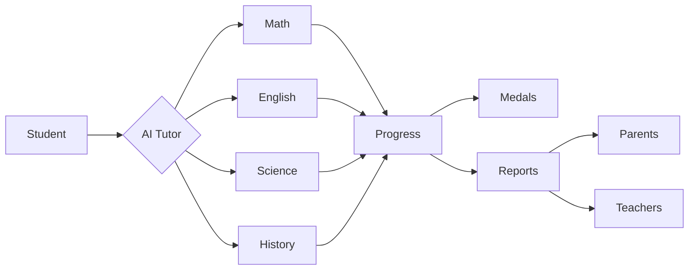

# AI Study Pals

Next-generation AI-powered learning platform for grades 1-6

<div class="pt-12">
  <span @click="$slidev.nav.next" class="px-2 py-1 rounded cursor-pointer" hover="bg-white bg-opacity-10">
    Press Space for next page <carbon:arrow-right class="inline"/>
  </span>
</div>

---
layout: two-cols
---

# Market Opportunity

<v-clicks>

- EdTech market growing at 16.5% CAGR
- 74% of teachers want AI assistance
- $342B market size by 2025
- Gap in AI solutions for grades 1-6

</v-clicks>

::right::

<div class="ml-4">
  ```mermaid {scale: 0.7}
  pie
    title EdTech Market Share
    "K-12" : 45
    "Higher Ed" : 30
    "Corporate" : 25
  ```
</div>

---
layout: image-right
image: https://source.unsplash.com/collection/94734566/1920x1080
---

# Key Features

<v-clicks>

- 🤖 Subject-specific AI tutors
- 📊 Visual progress tracking
- 🏅 Achievement medals
- 📝 Assignment analysis
- 👥 Parent & teacher dashboards
- 🛡️ Safe, grade-level content

</v-clicks>

---

# Product Workflow



---
layout: two-cols
---

# Revenue Model

<v-clicks>

- Freemium subscription
- School partnerships
- District-wide licensing
- Premium features
- Parent add-ons

</v-clicks>

::right::

# Projections

```ts {all|2|1-6|all}
const revenue = {
  year1: '$2.5M',
  year2: '$8.7M',
  year3: '$24.2M',
  users: '500K+'
}
```

---
layout: center
class: text-center
---

# Ready to Transform Education

[Contact Us](mailto:contact@aistudypals.com) · [Demo](https://demo.aistudypals.com)